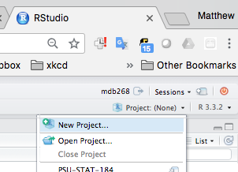
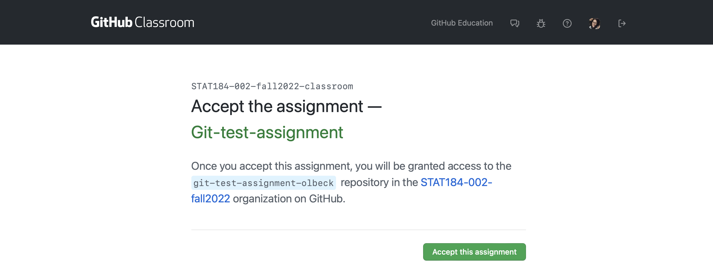
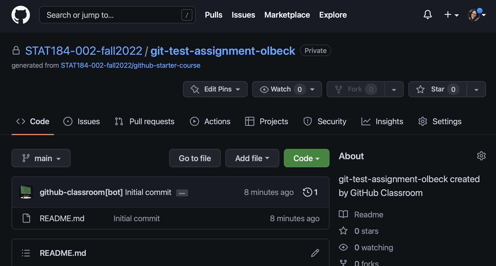

# Prerequisites

- Install R
- Install RStudio
- Install Git
    - Help resources for various operating system: <https://happygitwithr.com/install-git.html> 
    - If you aren't sure, try this:
        - Open a terminal: "RStudio >> Tools >> Terminal >> New Terminal"
        - After the dollar sign prompt enter these two commands
            - `which git`
            - `git --version`
        - If git is installed, the result will indicate where it is located and what version you are using
        - Once you have it installed carry on to the next section.

A more complete guide to configuring Git(Hub) and RStudio is available at <https://happygitwithr.com/>, but the work-aid below is generally sufficient for most of our purposes.

- Generate a personal access token: <https://docs.github.com/en/authentication/keeping-your-account-and-data-secure/creating-a-personal-access-token>

# To clone a repository ... 

## In GitHub...

0. Create GitHub user id (if you haven't done so already)
    - I recommend you use some derivative of your actual name (mine is `mdbeckman`)
    - Choose a name that you are comfortable sharing during a job interview 
    - Better yet if it's a name that is *recognizable* as you (e.g. a psu id like `mdb268` is fine, but NOT recognizable to those outside Penn State)
1. Log in
2. Create Repo for your project (or navigate to an existing Repo)
3. Click the green button "Clone or Download" and then Copy the URL shown below

 

## In RStudio...

4. Open RStudio
5. Select "File >> New Project" OR Click on the "Project" menu shown in the upper right corner of the RStudio Window

 

6. Select "Version Control"

 

7. Select "Git"

 

8. Establish the connection (Clone Git Repository)
    - "Repository URL": Paste the URL that you previously copied from GitHub
    - "Project Directory Name": This will be the name of a new folder (i.e. directory) on **your computer**. Use the same name as your GitHub Repo (e.g. mine was "Informative-Repo-Name" here). 
    - "Create Project as a Subdirectory Of": This is the location on **your computer** for the new folder. For example, I recommend that you make a folder for all of your STAT 380 projects and then put this Repo (and others for STAT 380) together in that directory.

 

9. You're in! (hopefully)... note the following
    - the "Project" menu shown in the upper right corner of the RStudio Server Window now shows the name of my Repo/Project (e.g. mine was "Informative-Repo-Name" in this case)
    - a new "Git" tab appears and has started tracking file changes in my Repo. The two files shown (".gitignore" and something ending in ".RProj") basically help Git & RStudio handle logistics, just "commit" and "push" them.
 
 
# After the repository has been cloned...   
    
## How to push/pull files to/from Github 
    
10. Open the project. Either.... 
  - Open an existing local repository on your computer : Open RStudio. Click on the the project button at the very upper left-hand corner of RStudio, click open project, find the location of the project on your computer, click the .Rproj file and open. 
  - Or clone a repository on your local computer: start at step 2 above. 

11. In the "Git" tab, click "Pull". This will ensure the files on your computer is up to date with the ones on GitHub. If your files are up to date a message will display saying "Already up to date". If your files are behind what is on GitHub, it will update your local files and give you a list of the files it updated.

12. Edit your files. Click "save" to save them to your local computer (this does not save them to GitHub. )

13. Commit your changes
    - select the check boxes to "stage" the changes... only the files you select will be part of this commit
    - Select "Commit"
    - A new window pops up where you should enter an informative commit message and look over the "Diff"... if there were a previous committed version of the file, the Diff summarizes all changes since
    - Press "Commit" 
    
14. Push your commits to GitHub. The changes aren't on GitHub until you PUSH them!!

15. (Optional step I recommend) When you are done working on your current code project, close the project by clicking on the the project button at the very upper left-hand corner of RStudio, click close project. (This will ensure any code you do from here on out does not affect the .Rproj). The projects button should now say "Project (none)". When you want to open this project back up, start back at step 10!

Repeat steps 10-15! 

# Using GitHub in STAT184

16. From here on, nearly everything (~90-95%) of your workflow for coding assignments can happen in RStudio... at least in STAT 184. 
  - All Activities will have a repository hosted in the "STAT-184-002-fall2022" GitHub Classroom. You will need to clone a repo for each activity. (this ensure the grader and myself can see everything in your repo)
  - To find the URL you need for step 3 .... 
  (i) Navigate to the class canvas page and open the assignment. Click on the assignment link (this is not the link to the github repo). 
  

  (ii) This will take you to the assignment link on the GitHub classroom page. Click "Accept this assignment". There should be a list of the class roster. Select your name from the roster when you accept the assignment. If you ever do not see your name, let Olivia know as soon as possible. 

  (iii) This generates a repo **in the STAT184-002-fall2022-classroom repo with the name assignment-name-YourUserName**. In this example, the repo it generated is STAT184-002-fall2022-classroom/Git-test-assignment-olbeck (my GitHub username is olbeck). If you did the above step correctly you should seed the following page: 
  
  

  - Refresh the page to get a link to your assignment repo. 
  
    

  - Click on the link in blue to be sent to the actual repository page. From here, go back to step 3 to clone this repo on your computer. 
  
  

- When you turn in your assignment.... 
  - I will tell you explicitly in the Canvas Assignment which files I want turned in on Canvas. 
  - Your pushed commits are the portion that are "turned in" on GitHub. There is not Turn In or Submit button on GitHub. But since we are doing everything though GitHub Classroom, I can see your repo and read all of your commits and commit messages. These files in GitHub will also be graded. This is why it's important to push!   
    - I highly encourage you to check on github.com if your chages pushed. If you cannot see it in github.com, neither can I!

17. Accessing Class Notes. Everything that I present in class can be found in our course GitHub page at https://github.com/STAT184-002-fall2022/course-materials. From this link you can start at step 3 to download a local copy of my notes on your computer. Before each class, pull to get the most up to date version of my notes. 

18. If (when) you encounter problems look here first...
    - <http://happygitwithr.com/>
    - Google it!
    - Google it again with different search terms!
    - Ask a question on the class Canvas Discussions 
    - Visit office hours/ make an appointment with Olivia

