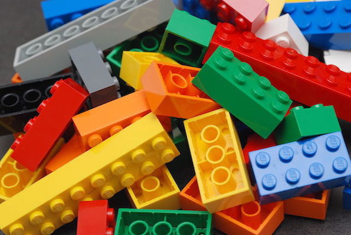

```{r setup, include=FALSE}
knitr::opts_chunk$set(echo = FALSE)
```

## Today's Objectives 

- Quick introduction
- Motivation of the course
- Course Materials
- Syllabus fly-over
- Get R and RStudio Installed

## A Little About Me.... 


## Examples of contemporary data

### Taxicabs and the Shared Economy

- A team of mathematicians and engineers has calculated that if taxi riders were willing to share a cab, New York City could reduce the current fleet of 13,500 taxis up to 40 percent. [Link to NYT story](http://www.nytimes.com/2014/09/02/science/sharing-taxis-nyc-mathematics.html).
    - Old school: get a sample of taxi passengers, and them where they got on and where they got off the taxi.
    - New school: 
        - *Every* taxi transaction is registered, including GPS coordinates of flag up and flag down
        - A taxi-hailing app can register all calls for service, even those that aren't successful


### Gapminder

- Income & Life Expectancy:  
    - <https://www.gapminder.org/tools/#$chart-type=bubbles&url=v1>  
    - How many variables are being displayed here?
    - What are they?
    - What did you learn by watching the animation?

- Dollar Street 
    - <https://www.gapminder.org/dollar-street/matrix>
    - Are we even looking at "data" here?


## The logic of this course: Less volume, more creativity.

- A minimal set of simple tools can be combined in powerful ways
- We can combine these simple tools to achieve complex purposes.

Individual lego bricks are simple.^[Source : "Lego Color Bricks" by Alan Chia - Lego Color Bricks. Licensed under CC BY-SA 2.0 via [Wikimedia Commons](http://commons.wikimedia.org/wiki/File:Lego_Color_Bricks.jpg#mediaviewer/File:Lego_Color_Bricks.jpg)]  | A complex model made of lego bricks ^[Source: *Trafalgar Legoland 2003* by Kaihsu Tai - Kaihsu Tai. Licensed under CC BY-SA 3.0 via [Wikimedia Commons](http://commons.wikimedia.org/wiki/File:Trafalgar_Legoland_2003.jpg#mediaviewer/File:Trafalgar_Legoland_2003.jpg)]|
----------------------------- | -----------------------------  |
|  |


## The logic of this course: Less volume, more creativity.


Some Foundations:


- Commanding the computer to handle data and present the story we want to tell
    - focus on "exploratory data analysis"
    - we will combine graphs, numerical summaries, and narrative
    - we generally defer to other courses for formal "modeling" (e.g., inference & prediction)
- Basics of "tidy" data
- How to "wrangle" the data we **have** into the form we **need**
- Relationships between data and graphical presentations
- Proper form of data to create graphics (or models) 
- Use of layering to develop rich graphics 


## Examples from many fields

Some data sets we will use for examples.

<pre>
BabyNames                Names of children as recorded by the US Social
                            Security Administration.
CountryData              Many variables on countries from the 2014 CIA factbook.
MedicareCharges          
MedicareProviders        
Minneapolis2017          Ballots in the 2017 Mayoral election in Minneapolis
NCI60                    Gene expression in cancer.
WorldCities              Cities and their populations
ZipDemography            Demographic information for most US ZIP Codes (Postal Codes)
ZipGeography             Geographic information by US Zip Codes (Postal Codes)
registeredVoters         A sample of the voter registration list for Wake County, 
                            North Carolina in Fall 2010.
</pre>


## Exploratory data analysis (EDA)

Due to the nature of the course and our goals, we will often characterize our work from the paradigm of *Exploratory data analysis (EDA)*.  Our goals for high-quality EDA include:

1. **Examine the data source:** variable types, coding, missingness, summary statistics/plots, who/what/when/where/why/how data were collected
2. **Discover features that influence may modeling decisions:** investigate potential outliers, consideration for recoding variables (e.g., numeric data that's functionally dichotomous), evaluate correlation structure (e.g., autocorrelation, hierarchy, spatial/temporal proximity)
3. **Address research questions:** build intuition and note preliminary observations/conclusions related to each research question.  Also, note observations that prompt you to refine your research questions or add new questions to investigate


## Orientation to Class Resources

- Lots of essential stuff launches from Canvas directly
    - Textbooks
    - Canvas Discussions
    - RStudio Cloud
    - Turn In Assignments

- R and RStudio 
    - **R** does the computations
    - **RStudio** is an interface to R that makes it easier to document your work, access nice features of R, and more
    - **Rstudio.cloud** is a website that allows you to run Rstudio on your browser

- git and GitHub
    - **git** is version control software used to facilitate collaboration and project evolution
    - **GitHub** is a remote git repository hosting service
      - I keep all class lectures on GitHub
      - Eventually we will move to assignments on GitHub Classroom (don't worry about this right now)

- Get access to R / RStudio right away! 
    - RStudio Cloud <https://rstudio.cloud/> (free version)
    - Install BOTH R & RStudio on your computer (requires config)
        - R software (free): <http://cran.rstudio.com/>
        - RStudio Desktop (free) <https://rstudio.com/products/rstudio/download/>
        - Do this soon!  Get help if needed (Google, Canvas Discussions, friends, office hours)

- R Packages / Libraries: these are software modules that extend the functionality of R.  
    - We need to **install** the package just once to *download* it on your computer.  
    - We need to load the package/library to *use* it each time we start a new R session 
    
- All of my course sides are posted on github: <https://github.com/stat184-summer2023/course-materials>

## Assignments and Questions


- Assignments, grades, etc will be handled with Canvas  
- Use Canvas Discussions for most questions about course content, e.g. "How do I rename a variable?"
    - I'll redirect you to post things on Canvas Discussions when other students would benefit from the question and the answer
    - Email is generally for private issues that aren't relevant to other students


