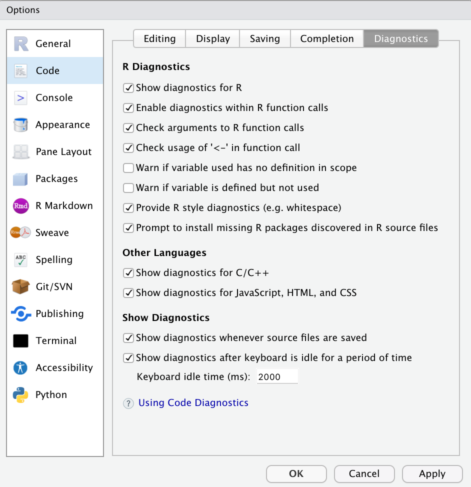
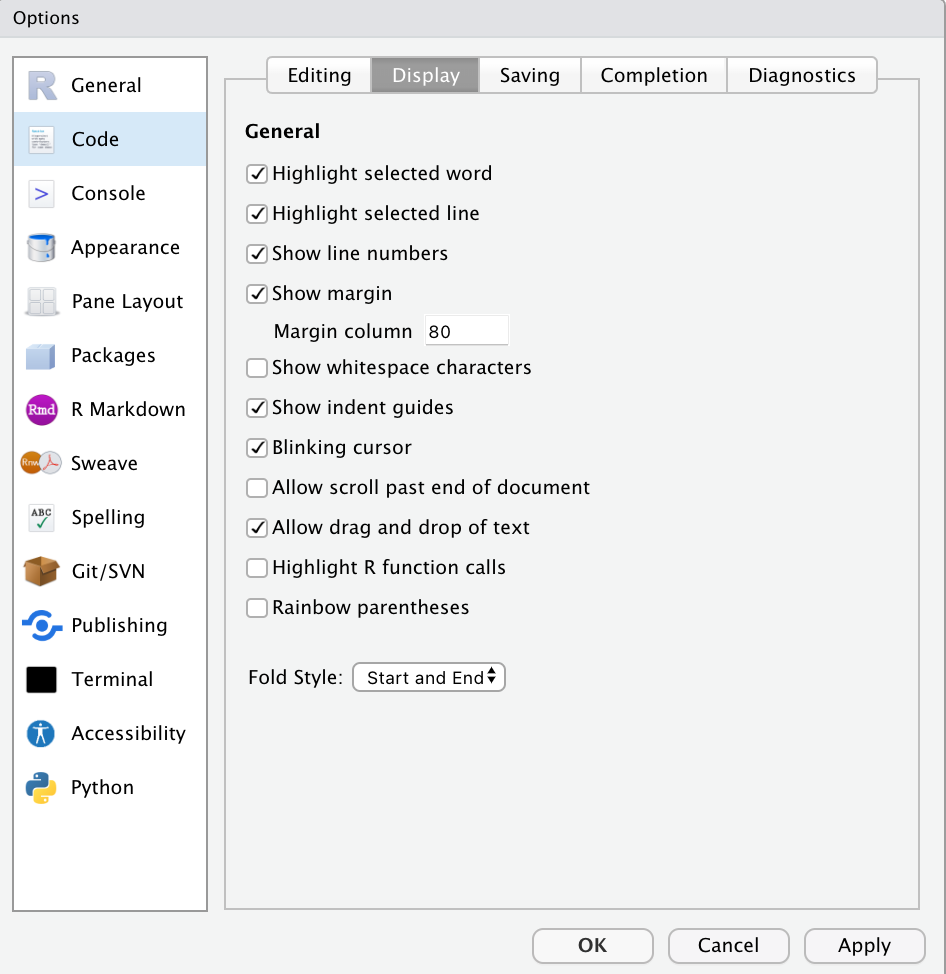
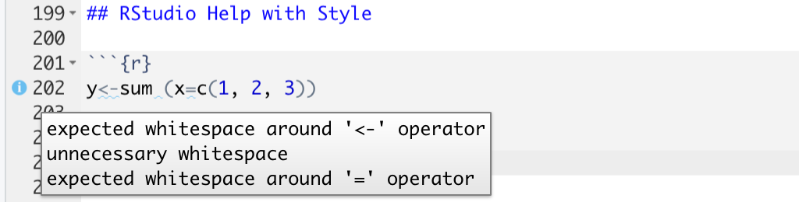

<style type="text/css">
  body{
  font-family: Helvetica;
  font-size: 12pt;
}
</style>


## Ethical Programming  


<center> 

"Ethical programming includes being honest about
the extent to which you can be confident that your program is
good, and adhering to quality control processes that ensure that
if a mistake has been made – everybody makes mistakes – it is
found and rectified before it causes harm."


-PERDITA STEVENS

</center>

## Good programs.... 

- do what they are supposed to do 

- are clearly written 

  - Your code must be readable 
  
  - Use comments! 

- do not cause harm 


## R Terminology 

- **R** is the programming language.

- **Rstudio** is a user interface to R that makes it easier to document your work, access nice features of R, and more.

  - You do not need Rstudio to use R, but it does make it much easier
    
- **CRAN** is a repository where the latest downloads of R (and legacy versions) are found in addition to source code for thousands of different user contributed R packages.


- **Packages** are collections of R functions, data, and compiled code in a well-defined format.

  - Packages need to be installed only once: `install.packages()`
  
  - Some packages are installed with R automatically:  `stats`, `graphics`, `grDevices`, `utils`, `datasets`, `methods`, `base`
  
  - All other packages need to be installed 

- **Libraries** are the directories where the packages are stored on your computer

  - Libraries need to be loaded every time you need them at the beginning of your script with `library()`
  
  - Every time you install a package, you also need to load the library
  
  - There is a way to access a function inside a package without loading it with package_name::function_name (this is more advanced and we will discuss it later)
  
- **Markdown** is a lightweight markup language that you can use to add formatting elements to plaintext text documents

  - **LaTeX** is a document preparation system for high-quality typesetting. LaTeX and Markdown work seamlessly together

- **RMarkdown** is integrating R and Markdown into one document

  - You can render RMarkdown documents into pdf's, HTML, Word doc's, beamer's, slidy's, RNotebook's
  
  
## Pacakages 

- **Packages** are collections of R functions, data, and compiled code in a well-defined format, created to add specific functionality. 


- R packages are stored/shared in a few different places 
  - There are a set of standard (or base) packages which are considered part of the R source code and automatically available as part of your R installation
    -  `base``stats`,`datasets`, `graphics`, `grDevices`, `utils`, `methods`
    - these packages are loaded automatically every time you open R or RStudio
  - **CRAN** is a repository where the latest downloads of R (and legacy versions) are found in addition to source code for thousands of different user contributed R packages
    - when we want to install packages from CRAN we use `install.packages(PackageName)`.
    - most of the packages we use in this class will come from CRAN
  - **GitHub** is a code storage/sharing platform where some people store their R packages
    - when we want to install packages from CRAN we use `devtools::install_github("UserName/PackageName")` (note the use of the devtools package that you will first need to install from CRAN).
    - some packages we use in this class will be stored on GitHub
  - There are other places where people can store/share R packages, e.g. Bioconductor, sharing   source code. But we will not use these methods in this class. 

- Once you've installed a package, you never need to do it again. 
  - some packages have updates

```{r, eval = F}
#Installing a package from CRAN
install.package(PackageName)

#Installing a package from GitHub
install.packages(devtools)
devtools::install_github("UserName/PackageName")
```

- Sometimes packages contain other packages! 
  - The `tidyverse` package contains the packages `dplyr`, `ggplot2`, `forcats`, `readr`, `stringr`, `tibble`, `tidyr`, and `purrr.` 


- The directories in R where the packages are stored are called the **libraries**
  - the term package and libraries are sometimes used synonymously, but they *technically* are two different things. For this class, it's not important to understand the technical differences. 
  
- When ever we want to use the functions or data inside a package, we use the `library()` function to load it into our work space. 
  - regardless of how you installed the package, you always use the `library()` function to load it
  - every time we open a new session of R, we need to load the libraries we want to use

```{r, eval = F}
#load the package into our work space 
library(PackageName)
```

  
Here are the packages we need to get started in this class.  Copy the code chunk below into your console and run it. (This will take a long time)

```{r, eval = F}
install.package(tidyverse) 
install.packages("devtools")
devtools::install_github("mdbeckman/dcData")

```
  
  
  
## File Extensions 

- **.R** is an R script

- **.Rmd** is a Rmarkdown document 

  - The raw Rmarkdown document will have extension .Rmd
  
  - The rendered document will have the appropriate extension 
  
 - | File Type | Extension | 
| --------- | ----------| 
| PDF | .pdf| 
| HTML | .html| 
| Slidy | .html| 
| Rnotebook | .nb.html|
| Word document | .docx |
| Excel document | .xlsx |
| Comma-seperated values | .csv|
| Tab-seperated values | .tsv |


## Conventions (i.e. Style)

- It's important to note that conventions are for the benefit of users & consumers of your code. 
- **R will not "enforce" them for you** (but RStudio can help...see end of slides)
- Style will be graded on several assignments (using RStudio config)
   - I will always be clear in an assignment what stylistic objects I'm grading on. For example, in the Tidy Data Activity, I will tell you to have a descriptive file names and to use no spaces in the file, but I will not specify the exact names for each column. 
   - A few things that I will always expect: 
        - No spaces in file names 
        - Names are always descriptive (files, variables, functions, column names in data frames)
    - What ever style guide you pick, stay consistent! 
        - I personally like tidyverse styling convention: 
            - file-path/file-name.extension
            - `function_name()`
            - `variable.name` 
            - `dat.storage`
        - But you do not have to stick with these. The DC book does not use these. This book prefers DataStorage and variablename. 
        - Everyone's style is different. The best way to find your style is to adopt someone elses (then modify it as you get better at coding)
    
### Popular conventions:

- whitespace, comments, long lines
    - be generous with whitespace (R just ignores it in most cases, and it makes code MUCH easier for humans to read)
    - Use the `#` character to include comments within code chunks (again be generous; R ignores comments)
    - limit length of R commands to about 80 characters

- object assignment & naming
    - use `<-` for assignment (not "=")
    - use descriptive but concise object names (harder than it sounds, but totally worth it)
    - use camel case, "-", "_", or "." for names with multiple words 
      - VariableName, variable.name, variable-name
      - DataTable, data.table, data-table
      - Whatever you pick, be consistent!

### Style Guides

There are several published style guides to help R programmers write beautiful code.  

- [Data Computing eBook by Kaplan & Beckman (see Appendix: R Programming Style Guide)](https://dtkaplan.github.io/DataComputingEbook)
- [Tidyverse Style Guide by H. Wickham](https://style.tidyverse.org/)
- [Google's R Style Guide (allegedly)](http://web.stanford.edu/class/cs109l/unrestricted/resources/google-style.html)


## Good Coding Practices 

## Assign vs. Equals

- Use "<-" (assign) not "=" (equals) when assigning variable/function values 

  - In R, "<-" is used to assign variable/function names and "=" is used inside functions for arguments 

```{r}
# Good 
x <- 1:5
quants.good <- quantile(x, probs = c(0.1, 0.9))

# Bad 
x = 1:5
quants.bad = quantile(x, probs = c(0.1, 0.9))
```


## Naming conventions 


- NEVER use spaces to name things 

  - file paths/names should use "-". e.g. file-name.R
   
  - function names should use "_". e.g. `funciton_name()`
  
  - variable names should use "." e.g. `variable.name` 

- Use lower case letters when possible 

  - good: file-name.R, `function_name()`, `varaible.name`
  
  - bad: File-Name.R, `Funciton.Name()`, `VaRiAbLe.NaMe`

- SomePeopleLikeToUseCamelCase


- Anything you name should be meaningful. This includes file names, function names, variable names, etc. 

Let's look at the `iris` data set:

```{r}
head(iris)

# Good 

dat <- iris

# get the 2 columns that have "petal" in their names 
dat.petal <- dat[ , c("Petal.Length", "Petal.Width") ] 

#this is a function to determine if a number is greater than 1
greater.than.1 <- function(x){
  return(x>1)
}

# Bad
x <- iris 
z <- dat$Petal.Width
f <- function(x){
  return(x>1)
}

```


- Avoid using base R defaults/functions as variable/function names 

```{r, eval = F}
# BAD
T <- 14

c <- 10 

mean <- FALSE
```

- USE COMMENTS
  - Helps others (and yourself) know what you did
  - You are your best collaborator! 

```{r}
# this is a function to determine if a number is greater than 1
greater.than.1 <- function(x){
  return(x>1)
}
```


## Using Spaces 


- Some coding languages respect white space, and others ignore it ... R does both


## When to use spaces

- Most of the time, R ignores white space. White space is often used to make code readable to the human eye. 

- Place spaces around all operators (=, +, -, <-, etc.). The same rule applies when using = in function calls. Always put a space after a comma, and never before (just like in regular English).
  
```{r, eval = F}
# Good
average <- mean(feet / 12 + inches, na.rm = TRUE)

# Bad
average<-mean(feet/12+inches,na.rm=TRUE)
```
 

  
- Extra spacing (i.e., more than one space in a row) is okay (but not required) if it improves alignment of equal signs or assignments (<-).

```{r, eval = F}
# Good 
list(
  total = a + b + c, 
  mean  = (a + b + c) / n
)

longer.variable.name <- 5
variable.name <- 1

longer.variable.name <- 5
variable.name        <- 1

```

- Use spaces in subsetting (except before `[`, see next slide). Spaces always go after commas, just like in English. 
   
```{r, eval = F}
# Good
diamonds[5, 6] #space after commas, just like in English
diamonds[5, ] #always use a space when you leave an index blank 


# Bad
x[1,]   # Needs a space after the comma
x[1 ,]  # Space goes after comma not before
x [1, ] # No space before "["
```
 
 
## When not to use spaces 
  
- There are a small number of cases where R respects white space 

  
1.  :, :: and ::: can't have spaces around them.
  
```{r, eval = F}
# Good
x <- 1:10
base::get

# Bad
x <- 1 : 10
base :: get
```
 
2. When subsetting with `[]` , the first `[` cannot have a space before it. 

```{r, eval = FALSE}
#good
x[ 1 ]

#bad
x [ 1 ]
```


3. `<-` (assign) must NEVER have a space between the `<` and the `-`. 
  - `x <- y` (assign) v. `x < - y` (is x less than -y)

```{r}
#assign 
y <- 5
#is y less than -5?
y < - 5
```


4. Place a space before left parentheses, except in a function call.

```{r, eval = F}
# Good
plot(x, y) #function call 

# Bad
plot (x, y) #no space before "(" in function call 
```
  
5. for, while, if loops (we will talk about these later)

  

## Lines of Code 

- Strive to limit your code to 80 characters per line. This fits comfortably on a printed page with a reasonably sized font. If you find yourself running out of room, this is a good indication that you should encapsulate some of the work in a separate function.

  - Use the light gray line on the left side of the console in RStudio

- An opening curly brace should never go on its own line and should always be followed by a new line. A closing curly brace should always go on its own line, unless it’s followed by else. Always indent the code inside curly braces. (don't worry about this right now, we will come back to it later)

```{r, eval = F}
# Good
if (y < 0 && debug) {
  message("Y is negative")
}

if (y == 0) {
  log(x)
} else {
  y ^ x
}

# Bad

if (y < 0 && debug)
message("Y is negative") #no curly braces and message is on next line

if (y == 0) {
  log(x)
} 
else {  #else needs to be on the same line as "}"
  y ^ x
}

```
  
- It’s okay to leave very short statements on the same line:

```{r, eval = F}
if (y < 0 && debug) message("Y is negative")
```


## Indentation 

- When indenting your code, use two spaces. Never use tabs or mix tabs and spaces.

  - a tab is usually 12 spaces
  
  - in Rstudio you can set your tab button to be 2 spaces: Tools > Global Options > Code > Editing > General > Check "Insert spaces for tab" > Set tab width equal to 2 spaces
  
  - You can set up auto-indent by: Tools > Global Options > Code > Editing > General > Check "Vertically align arguments in auto-indent"

- The only exception is if a function definition runs over multiple lines. In that case, indent the second line to where the definition starts:


```{r , eval = F}
# Good 
long_function_name <- function(a = "a long argument", 
                               b = "another argument",
                               c = "another long argument") {
  # As usual code is indented by two spaces.
  return(a + b + c)
} 

long_function_name <- 
  function(
    a = "a long argument", 
    b = "another argument",
    c = "another long argument"){
  # As usual code is indented by two spaces.
  return(a + b + c)
} 

if (y == 0) {
  log(x)
} else {
  y ^ x
}

# Bad 
long_function_name <- function(a = "a long argument", 
  b = "another argument",
  c = "another long argument")  {
  # As usual code is indented by two spaces.
  return(a + b + c)
} 
  
if (y == 0) {
log(x)
} else {
y ^ x
} 
  
```


## RStudio Help with Style 


RStudio has some basic support built in (required for STAT 184), but more comprehensive support is provided by the `lintr` package (recommended).

**RStudio >> Tools >> Global Options >> Code >> Diagnostics >> check nearly all boxes (both "warn if variable..." settings can be optional)** 




**Global Options >> Code >> Display >> (show line numbers; set margin = 80; others optional)**




Once configured, when RStudio detects styling errors:

- a blue "information" dot appears in in the margin
- hover your cursor on the "information" dot for a description of each error
- a wavy blue underline appears under the error (though hard to see)




Feel free to customize your RStudio settings to whatever you want! 


## Additional Readings 

- Advanced R by Hadley Wickham Ch. 22 <http://adv-r.had.co.nz/Style.html> 

- How to Write Good Programs by Perdita Stevens Ch. 2 & 3


## References 

- https://hbctraining.github.io/Intro-to-R-flipped/lessons/04_introR_packages.html. 

- https://www.statmethods.net/interface/packages.html

- https://hbctraining.github.io/Intro-to-R-flipped/lessons/04_introR_packages.html

- https://www.markdownguide.org/getting-started/

- https://rmarkdown.rstudio.com

- http://adv-r.had.co.nz/Style.html


