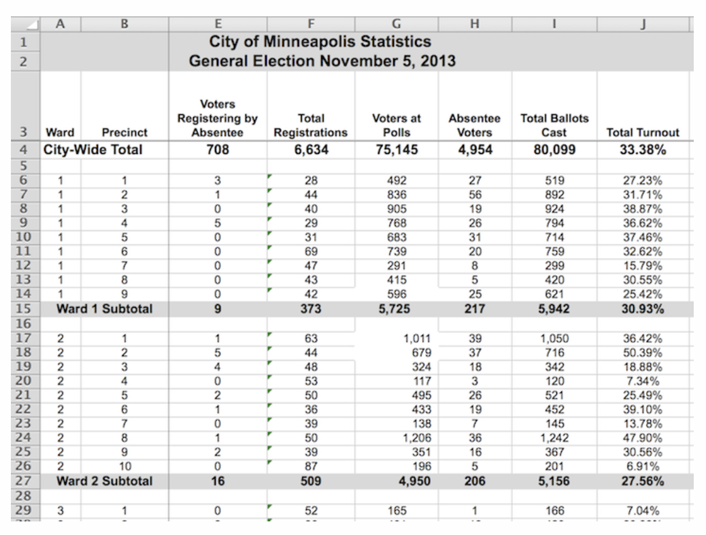
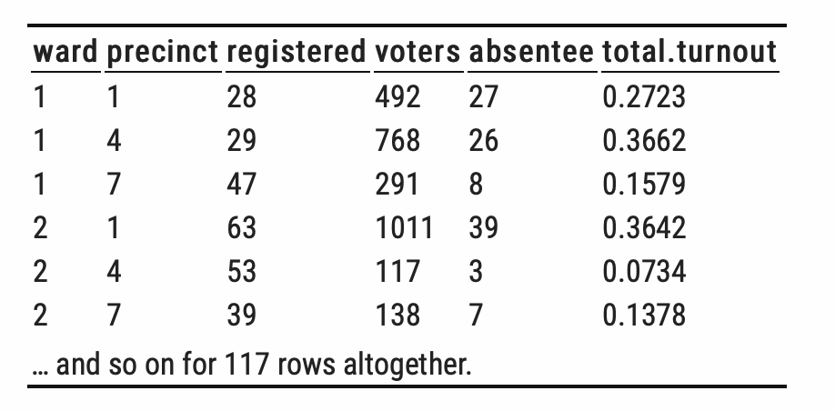
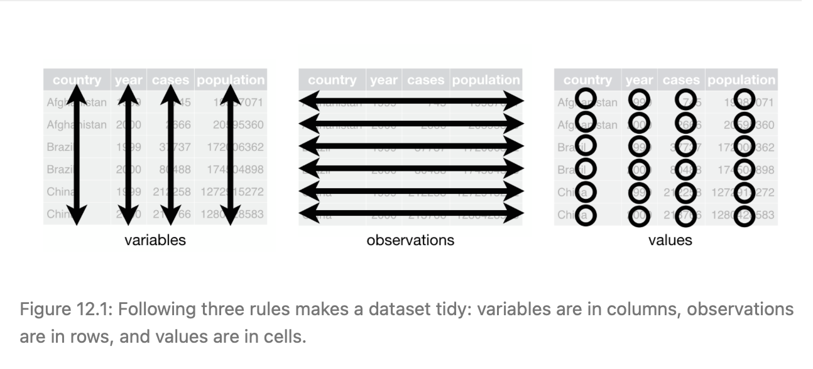
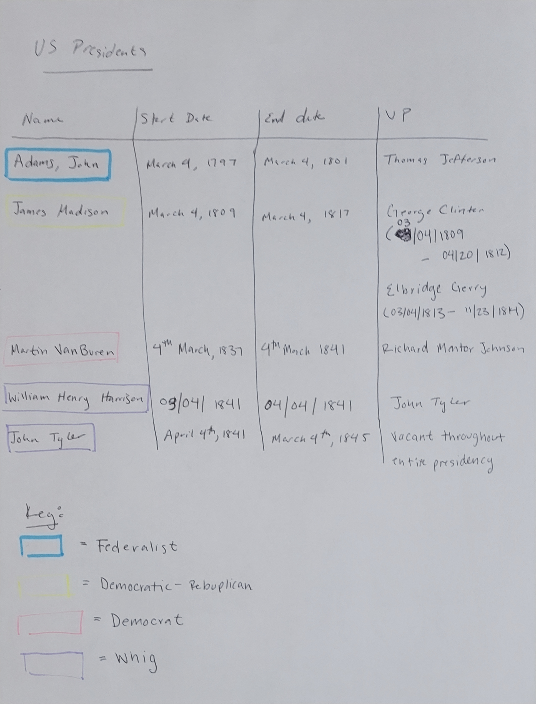

## Tidy Data

“Happy families are all alike; every unhappy family is unhappy in its own way.” –– Leo Tolstoy

“Tidy datasets are all alike, but every messy dataset is messy in its own way.” –– Hadley Wickham


- Key ideas:
  - Cases = Rows
  - Variables = Columns 
- How should we define **case**?
- How do we identify **variables**?
- Advantages and Disadvantages 

## Vocabulary 

**Variable** 

- In data science, the word variable has a different meaning than in mathematics. 
  - In algebra, a variable is an unknown quantity. 
  - In data, a variable is known; it represents a feature that has been measured or observed. “Variable” refers to a specific quantity or quality that can vary from one case to another.
  
- Types of variables
  - quantitative : a number
  - categorical (R calls these factors): tells which category or group a case falls into
  - all non-numerical values are categorical, but not all numerical values are quantitative
    - e.g. zip code, IP address, dates 
    
**Cases**

- Unit of observation or analysis 
  - this is extremly context specific 


## What is Tidy Data 

- Being neat is **not** what makes data tidy!


There are three interrelated rules which make a dataset tidy:

1. Each variable must have its own column.
2. Each observation/case must have its own row.
3. Each value must have its own cell.

It is your job as the researcher to define the variables, observations, and values. 

- The "tidyness" of the data set depends on the research question. It is not an inherent property to the data set itself. 
- When data are in tidy form, it’s often straightforward to transform the data into arrangements that are useful for answering interesting questions.


Example of Untidy data 



Example of Tidy Data




- Disadvantages
  - tidy data can be hard for human to quickly interpret 
  - often not the ideal form for creating graphics
- Advantages 
  - clear definitions
  - tidy data can easily be *wrangled* to a useful form for interpretation and visualization 


## Tidy Data Example

From https://r4ds.had.co.nz/tidy-data.html 


You can represent the same underlying data in multiple ways. The example below shows the same data organised in four different ways. Each dataset shows the same values of four variables country, year, population, and cases, but each dataset organises the values in a different way.

Which ones of these is tidy? 

#### Option 1

```{r}
library(tidyverse)
table1
```


#### Option 2

```{r}
table2
```


#### Option 3

```{r}
table3
```


#### Option 4

```{r}
table4a
table4b
```


## Example Continuted 

Table 1!



- Note that all tables contain the same information, just represented differently. Thus, we can transform Tables 2, 3, 4a/4b into Table 1, and vice versa.


## Galton Data

In the 1880s, Francis Galton started to make a mathematical theory of evolution.  

Here's part of a page from his lab notebook.  Discuss the following in groups:

- What might he investigate with these data (e.g., **Research Question**)?
- Are these data **tidy** according to our definition?
- What are the **cases**?
- What are the **variables**?
- How many **rows** of data should the result have?
- How many **columns** of data should the result have?  What is the data type of each column?
- What are some additional variables (not yet shown) that might be of interest?  How would you recommend showing that information in the data table?


## Activity 01: Tidy Data 

Work to put these tables in tidy form

- Work with your partner 
- As a team, you will put two different data sets into "tidy" form.  
- **See Canvas for details**
    - View-only source data is provided
    - use any software you like
    - must submit a CSV to Canvas 
    - do not use spaces in your file names 
- Tip: **Sketch things out together on paper before you do anything in the computer**


#### Table 1: **Galton's Height measurements data**


#### Table 2: **Presidents**




## Code Books 

### What is a code book? 

- A **codebook** describes the contents, structure, and layout of a data collection. 
- A well-documented codebook contains information intended to be complete and self-explanatory for each variable in a data file

- https://www.icpsr.umich.edu/web/ICPSR/cms/1983 

- Federal Elections Comission 
  - https://www.fec.gov/data/browse-data/?tab=bulk-data
  
  
## References 

- https://dtkaplan.github.io/DataComputingEbook/chap-tidy-data.html#chap:tidy-data
- https://r4ds.had.co.nz/tidy-data.html
- https://www.icpsr.umich.edu/web/ICPSR/cms/1983


