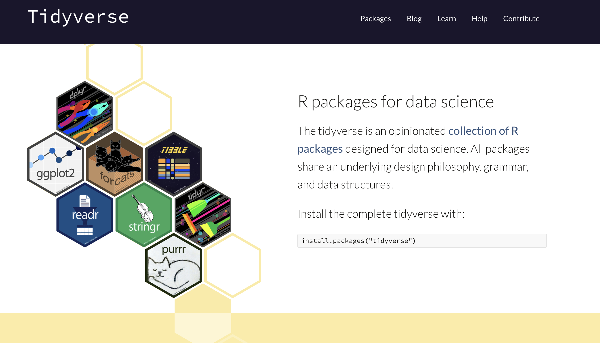

## Tidyverse




## What is the Tidyverse? 

- The `tidyverse` package contains the packages, 
  - `dplyr` - provides a grammar of data manipulation, providing a consistent set of verbs that solve the most common data manipulation challenges
  - `ggplot2` - system for declaratively creating graphics, based on The Grammar of Graphics
  - `readr` - readr provides a fast and friendly way to read rectangular data (like csv, tsv, and fwf).
  - `tidyr` - provides a set of functions that help you get to tidy data
  - `purrr` - purrr enhances R’s functional programming (FP) toolkit by providing a complete and consistent set of tools for working with functions and vectors
  - `forcats` - provides a suite of useful tools that solve common problems with factors
  - `stringr` - provides a cohesive set of functions designed to make working with strings as easy as possible
  - `tibble` - a modern re-imagining of the data frame, keeping what time has proven to be effective, and throwing out what it has not.
- The "tidyverse" is a consistent framework for storing, importing, wrangling, modeling, and visualizing data. 


- Managed by Rstudio (the company), now called Posit 
  - Code largely written by Hadley Wickham 
- In this class we will mostly be using `dplyr`, `tidyr`, `ggplot2`, and `readr`
  - we will use basic `stringr` near the end of the class 

- You don't need to know all the functions the tidyverse! We will be learning useful ones throughout the course.

## The pipe 

One operator that exists in the tidyverse that we will be using throughout this class is the pipe: `%>%`. 

- When you load `library(tidyverse)`, a new operator called the "pipe",  `%>%`, becomes available for you to use. 
- We use the pipe to form long chains of code. 

### The basics

- `x %>% f()` is equivalent to `f(x)`
- `x %>% f(y)` is equivalent to `f(x, y)`
- `x %>% f() %>% g() %>% h()` is equivalent to `h(g(f(x)))`

### Small Example

```{r}
library(tidyverse)
x <- 1:10

#the following are equivalent 
mean(x)
x %>% mean()
```


### Example of long chains of code using %>%
```{r}
# look at the data 
head(iris)

# find the mean and sd of petal widths by species type
iris %>%
  select(Species, Petal.Width) %>%
  group_by(Species) %>%
  summarise(mu = mean(Petal.Width),
            sigma = sd(Petal.Width))

```

### Help 

If you ever want to look at the help file for `%>%` run one of the following: 

```{r, eval = F}
?`%>%`
help(`%>%`)
```

Note the \` symbol around the `%>%`. It is the accent symbol (located on the key left of the 1 key). It is not a quotation mark. This is a quotation mark: \'. 


Aside: `    %>%` actually lives in the `magittr` package, which is also technically in the tidyverse, but lives in the "back-end" technical stuff. Learning exactly where `%>%` lives in the tidyverse is beyond this class. If you're interested in learning more, let me know!


## References 

- https://www.tidyverse.org 