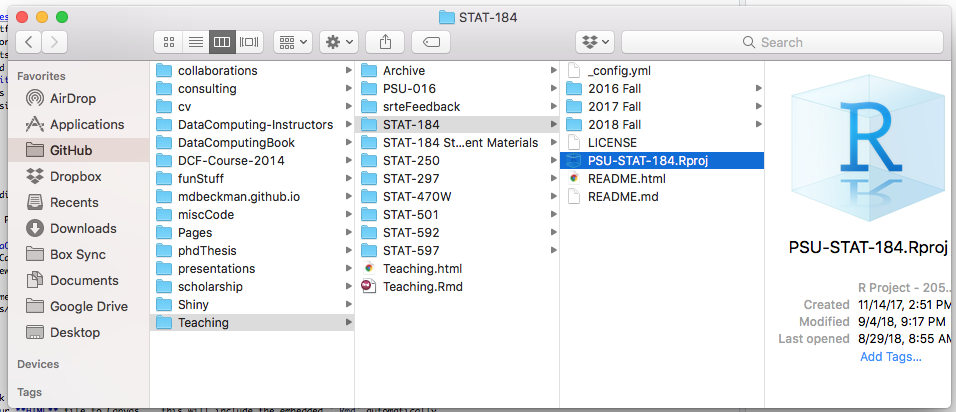
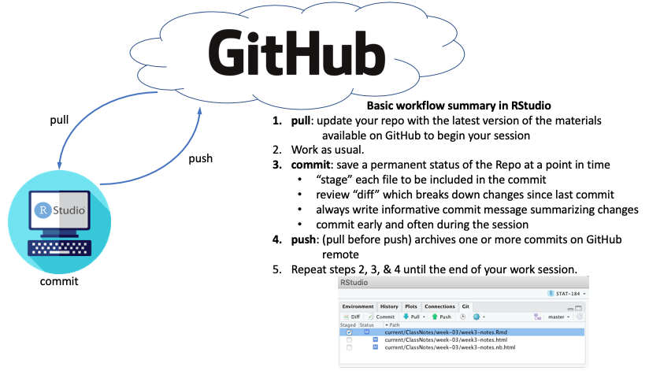
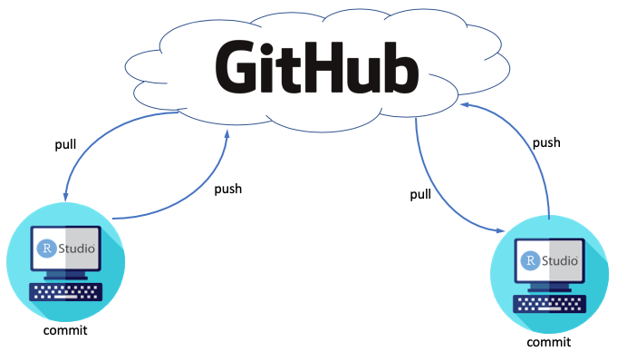
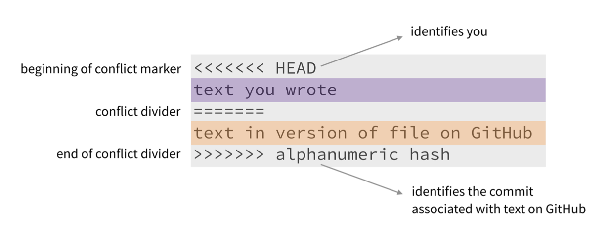
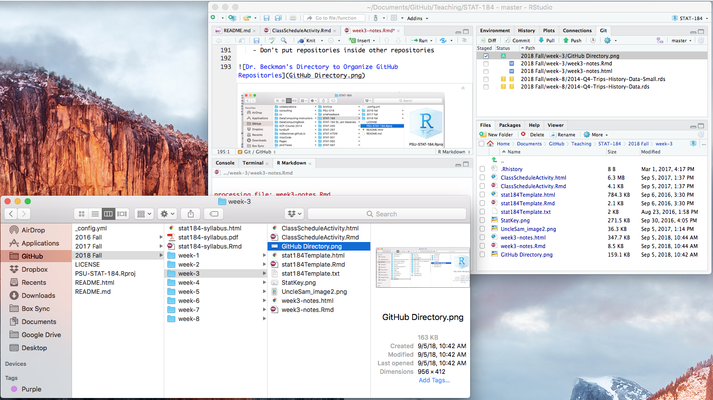

```{r include=FALSE}
# Frontmatter
rm(list = ls())      # prevents common errors

library(tidyverse)

```


## RProjects 


- An RProject is a designated folder on your computer that RStudio knows is "one project"
- RStudio projects make it straightforward to divide your work into multiple contexts, each with their own working directory, workspace, history, and source documents.
- Great resource for reproducability! 
- RStudio projects are associated with R working directories. You can create an RStudio project:
  - In a brand new directory
  - In an existing directory where you already have R code and data
  - By cloning a version control (Git) repository (this is what we will be doing for most of this class )
- When a new project is created RStudio:
  - Creates a project file (with an .Rproj extension) within the project directory. This file contains various project options (discussed below) and can also be used as a shortcut for opening the project directly from the filesystem. 
  - Loads the project into RStudio and display its name in the Projects toolbar (which is located on the far right side of the main toolbar)
  - Creates a hidden directory (named .Rproj.user) where project-specific temporary files (e.g. auto-saved source documents, window-state, etc.) are stored. This directory is also automatically added to .Rbuildignore, .gitignore, etc. if required. (These things are beyond the scope of this class)
- You never physically edit the .Rproj file. Everything the .Rproj needs automatically updates in the background. 
- Allows us to use local file paths

https://support.posit.co/hc/en-us/articles/200526207-Using-RStudio-Projects 

## Git / GitHub

- [See Chapter 9 in Data Computing eBook (link)](https://dtkaplan.github.io/DataComputingEbook/chap-version-control.html#chap:version-control) 
- Git is a version control system that allows you to have a history of every change you make to your documents.
- "GitHub is a code hosting platform for version control and collaboration. It lets you and others work together on projects from anywhere." 
- **Repositories ("Repos")** are used to organize each project
    - These can contain documents, images, folders, code, data, ... basically everything you need for your project 
    - "Larger" files (> 100 MB) need some special handling
    - We'll link each **GitHub Repository** to an **RStudio Project** (in a normal directory folder on your computer)
    - Pro Tip: Don't put repositories *inside* other repositories
- As far as your computer is concerned, the repository works just like any other directory (i.e. folder)
    - The only change is that GitHub now knows "where to look" on your computer
    - You edit files, save changes, etc
    - Best practice: when you are editing files inside a R project, make sure that .Rproj is open on Rstudio (you can verify using the RProject drop down at the top left of RStudio)
- Repositiories on GitHub are always easy to locate. The url always as the form www.github.com/user-name/repo-name. 
  - Files in GitHub are always www.github.com/user-name/repo-name/file-name.extension
  



## GitHub Credentials 

- GitHub requires 3 credentials for you to interact with them
  1. User name 
  2. GitHub password - password you use to log in to github.com
  3. Personal Access Token - *super secret* password GitHub gives you to push/pull/commit


## Git / GitHub Workflow

- When you save files like a Google Doc, there is only one step: click save. Then your file is saved and another person can access your saved changed. 

- When you save things you want on GitHub, there are 3 steps: pull, commit, and push.

Every time you want to access/change files on Git Hub you follow these basic steps:

1. **Pull** from Github - update the files on your computer with the most up-to-date versions on GitHub

2. Edit the files how ever you want. **Save them to your local computer** by clicking save (the floppy disk icon in Rstudio).  

3. **Commit** - this prepares the files to be sent to GitHub. You commit each file (can be done for each individual files or a group of files). Create a 1-2 sentence commit message. 

4. **Push** your commits to GitHub - the changes you made on your local computer are now stored in the cloud! 

5. Repeat! 




- **commit** changes
    - ideally, each commit should encompass *one meaningful modification* 
    - creates a permanent snapshot of the repository
    - you can revisit these snapshots at any time... 
    - note there is a difference between saving files on your computer (save) and saving them to GitHub (committ + push/pull)
- **push/pull** to remote
    - GitHub stores the state of your repository in the cloud
    - When you *push*, you update the remote version 
    - Anyone with access to your GitHub repository can *pull* the remote version and work with it
        - This might be you, using a different computer (like the RStudio Server)
        - It might be a collaborator like your STAT 184 paired programming teammate
        - It might be a professor or TA
        - If the repo is made public, it might be a complete stranger!
    - The collaborator can then commit changes and push them to the remote as well 





## Merge Conflicts

- Rare for single-user Repos unless you're contributing from multiple computers
- Git is good about merging changes from different collaborators as long as they stay out of each other's way
- a **merge conflict** occurs when collaborators make changes that are in direct conflict with one another (e.g., different versions of the same line(s) in the same document)
    - this is actually a very good thing because Git doesn't just overwrite changes of one user (that could be really bad)
    - Git instead lets a human decide which version of the work should ultimately be kept or removed in order to reconcile the apparent conflict




## Git / GitHub

- Once configured, nearly all of the action can happen in RStudio (or RStudio Server)
- A "Git" tab will appear in RStudio
- Diff, Commit, Pull, Push are most common actions
- Note: the project information is stored in the .Rproj file. 




## GitHub & RStudio (for STAT 184 assignments!)

- assignments are often deployed to you as Git Repos (hosted on GitHub)
  - Most will be in GitHub classroom (starting with activity A04)
- See DataComputing eBook for screenshots to import them into RStudio
    - [eBook appendix (link)](https://dtkaplan.github.io/DataComputingEbook/appendix-github-rstudio-configuration.html#appendix-github-rstudio-configuration)
    - You'll start from section "18.23 In GitHub..." at Step 3 in the Data Computing eBook

- For assignments, when I've given you a template Repo (i.e., a link deployed from Canvas)
  - you will store all of your assignment code inside a repo stored on the Course GitHub page
  - each assignment will have its own repo


## How to configure GitHub and RStudio when you want to start a new Repo

You do these steps every time you want to create a local version of repo on your computer.

1. Find the repo on GitHub by either copying an existing repo (1A) or creating a new repo (1B). 

  1A. If you want to copy and existing repo, go to that repo's github page, click on the green code drop down button and copy that link. It will be in the form of https://github.com/user-name/repo-name.git
  
  1B. If you want to create a repo, go to this list of your repo's on github, click the green New button a the top right, name your repo and give it a brief description, decide if you want it public or private, check the box "Add ReadMe file", add a .gitignore for R (open the drop down box and select R), choose a licence (usually the GNU General Public Licence is a good one), and click Create Repository. You will then need to open that repo on github, and copy the .git link the same way you would in step A.   
  
2. Create an Rproject linked to this repo on your computer

  2A. Open Rstudio. Click "Project (None)" on the top right-hand corner. Click New Project. 
  
  2B. Click Version Control. Click Git. 
  
  2C. In the repo URL paste the repo link that you got in step 1. The project directory name will automatically generate. Select the location on your computer where you want to save it. 
  
  2D. Click Create Project. 
  
  2E. Voila! You've downloaded a repo on your personal computer! 
  
  
## How to work with GitHub and RStudio

You do these steps every time. 
  
1. Open the RProject. Either... 

  Option 1A: Open RStudio. Click on the the project button at the very upper left-hand corner of RStudio, click open project, find the location of the project on your computer, click the .Rproj file and open. 
  
  Option 1B: Find the location of the project in your computer directory, click the .Rproj file and open. This should open your project in a new session in RStudio.
  
  If you did step 1 correctly there will be a tab named "Git" in the upper right panel (next to where the Environment tab is located) AND the project button (at the top left of RStudio) will have the project name (i.e. will not say "Project (none)"). If you did this step incorrectly, this will not be there and you will not be able to commit, push, or pull. 

2. Pull from GitHub. This will ensure your local version (on your computer) is up to date with the master version (on GitHub). 

  2A. Open the project on RStudio using the Project > Open on the top left hand side. 
  
  2B. Click Pull. If your version is already up to date, it will tell you so. If your version is behind what is on GitHub, then Git will try update your version (merge conflicts might happen)
  
  2C. Note, all changes must be committed before you can pull. 
  


3. Edit/Add/Delete documents as you want. Save them to your computer. (Doing this does not save them to GitHub, just your personal computer). 


4. When your are ready to send your changes to GitHub 

  4A. Click the "Git" tab on the upper right panel (this will not show up if you did step #1 incorrectly). Click Commit. Select the files you wish to commit. Type out a brief message of what the changes are that you made (1-2 sentences). NEVER LEAVE A COMMITT MESSAGE BLANK. Click Commit. You can (and should) have different commit messages for different (groups of) files.
  
  4B. When you have committed all of your changes, click Push. For user name, enter your GitHub username. When it prompts you to enter a password, **enter the personal access token you generated** (NOT your github password). 
  
  4C. If it was successful it will say something along the lines of "Merge to master complete". If it was not successful, it will tell you why (usually it's either merge conflicts, or you are trying to push a file that is too large)
  

5. (Optional Step I recommend) When you are done working on your current code project, 

  5A. close the project by clicking on the the project button at the very upper left-hand corner of RStudio, click close project. (This will ensure any code you do from here on out does not affect the .Rproj). The projects button should now say "Project (none)". 
  
  
  5B. When you want to open this project back up, start back at step 1! 
  

## How to configrue GitHub and RStudio for the very first time 

You only need to do these steps once. Try to install Git on your computer this weekend!  

1. Make an account on github ( You all have already done this! )

2. On you personal computer, open RStudio, and follow the instructions in Chapter 6 of Happy Git and GitHub for the useR: https://happygitwithr.com/install-git.html 
  - Pay attention to which operating system you have (Mac or Window). You only need to do the steps for your relavent operating system.
  - note the difference between your console and your shell/terminal. The console runs R code. The terminal runs unix on the operating system of your physical machine. You don't need to known unix for this class. Just follow the instructions in this book and make sure your outputs look close to the book's outputs. If you run into issues let me know.

3. Set up your global git configurations. Do EITHER step 3A or 3B. (I recommend you do step 3A. If you are familiar with unix, do Step B). 


 3A.  In the console, run this code but replace with your information:

```{r, eval = F}
## install.packages("usethis")

library(usethis)
use_git_config(user.name = "Jane Doe", user.email = "jane@example.org")
```
  
  3A. In the shell/terminal (different than the console) replace with your information: 
  
```{r, eval = F}
git config --global user.name 'Jane Doe'
git config --global user.email 'janedoe@email.com'
git config --global --list
```
 
  
4. Generate a personal access token 

Think of a personal access token as a super secret password that you use to push and pull with. The password that you use to login to GitHub’s website is NOT an acceptable credential when talking to GitHub. This was possible in the past (and may yet be true for other Git servers), but those days are over at GitHub. The following steps can be found [here](https://docs.github.com/en/authentication/keeping-your-account-and-data-secure/creating-a-personal-access-token). 

  4A. Go to your personal github page 
  
  4B. Click on your icon in the very upper right-hand corner, then click settings. 
  
  4C. Click Developer Settings on the very bottom of the list on the left. Click Personal Access Token 
  
  4D. Click Generate New Token. Enter your password. Name your token in the "Notes". Select length of token (this token will expire ). Select all the items on the list. 
  
  4E. Click Generate Token. COPY DOWN THIS TOKEN. GITHUB WILL NEVER GIVE IT TO YOU AGAIN.
  
## Homework 

- Install git on your computer and try to connect it to RStudio
  