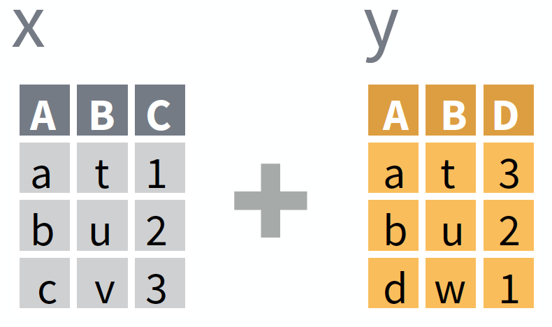
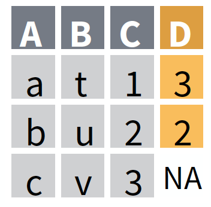
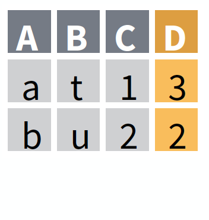
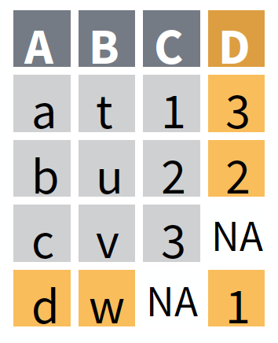
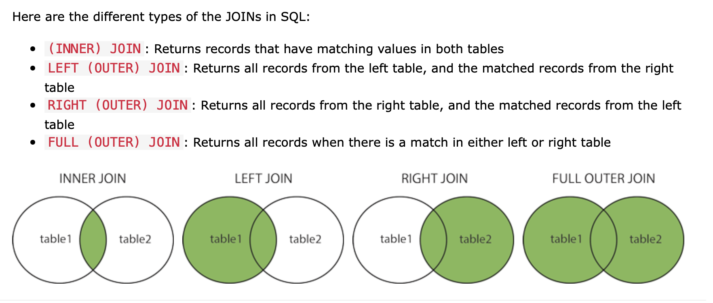

```{r include=FALSE}
rm(list = ls())
library(tidyverse)
library(printr)
library(mosaic)
knitr::opts_chunk$set(tidy = FALSE, message = FALSE)
options(width = 80)
```


## Reminders about assignments

- Remember to turn things in! 
  - Activities have a Canvas and GitHub portions

  
- It is good to use `esquisser` or `mplot` to generate graphs but...
  - These functions should be run in the console, NOT the RMarkdown document itself. 
  - If you include them in the RMarkdown document, your RNotebook will not render correctly
  - It is good practice to comment out the `esquisser` or `mplot` line in your RMarkdown document so you remember that you used it, but it does not actually run when the document is rendering
  
- Several of you are missing the easy points on assignments
  - Remember to read the entire question and answer all parts 
  - A lot of coding questions have a coding portion and a written portion (remember to do the written portion!)
  - Look at your RNotebook before you submit it
    - make sure you can see the **code**, the **graphs**, and the **written explanations**

## Agenda

- Discussion questions
    - what do "join" operations do and why should we care?
- Overview of join operations with examples


## Combining data from different sources

**Glyph-ready data often combines data from different sources.**

- Perhaps they come from different experiments or institutions.
- Often they were collected with different objectives than yours.
- Perhaps they are completely different types of data. 


## Example: Medicare data

**How might you combine data from several of these tables to answer an interesting research question.**

- `MedicareProviders`: Name and location
- `DirectRecoveryGroups`: Descriptions of standardized medical procedures
- `MedicareCharges`: Charges and payments for different DRGs by different providers
- `ZipDemography`: Population and age structure in each ZIP code.


## Relational databases

**Storing data in separate tables can be beneficial even when the data are coming from the same source: **

- Organizations can (and do) restrict access to tables with sensitive information, while permitting wider access with non-sensitive data tables 
    - HIPPA & patient identifiers in healthcare industry
    - FERPA & student records at educational institutions
- There is no "one size fits all" glyph-ready format.  Often the kinds of analysis that will be done are not specifically anticipated when data are collected. 
- Glyph-ready data often contains **redundancies**. 

**Strategy**: Join related tables *as needed* rather than smash all available data into one big table. 


Example of a redundency in Glyph ready data: 

```{r}
dat.A <- rnorm(n = 100, mean = 7, sd = 1)
dat.B <- rnorm(n = 100, mean = -3, sd = 2)

GlyphReady <- data.frame(letters = c(rep("A", 100), rep("B", 100)), 
                  numbers = c(dat.A, dat.B), 
                  center = c(rep(7, 100), rep (-3, 100)))

GlyphReady %>%
  sample_n(10)


GlyphReady %>%
  ggplot(aes(x = numbers)) +
  geom_histogram()+
  geom_vline(aes(xintercept = center), col = "red") +
  facet_wrap( ~ letters)

```

This glyph ready table is not an efficient use of storage. The column  `center` stores redundant information. It would be more efficient to store 2 tables like this: 

```{r}
dat1 <-  data.frame(letters = c(rep("A", 100), rep("B", 100)), 
                  numbers = c(dat.A, dat.B))
dat2 <- data.frame(letters = c("A", "B"),
                   center = c(7, -3))

dat1 %>%
  sample_n(10)
dat2
```

So how do we go from `dat1` and `dat2` to `Glyphform`? Joins!


## Basic joins



A *join* is a data verb that combines two tables called the **left** and the **right** tables.

* Joins establish a correspondence --- i.e. match --- between each case in the left table and zero or more cases in the right table.
* Some common joins we'll discuss simply differ in 
    - how multiple matches should be handled
    - missing matches should be handled


## Establishing a match between cases

A match between a case in the *left* table and a case in the *right* table is made based on the values in pairs of corresponding variables.

- **You** specify which pairs to use.
- A pair is a variable from the left table and a variable from the right table.
- Fine to specify several variables for matching
    - e.g., `by = c("A" = "var1", "B" = "var2")` 
    - matches `A` & `B` from left table to `var1` and `var2` from right table
- Cases must have *exactly equal* values in the left variable and right variable for a match to be made.
  - A & B and A & B are a match 
  - A & B and A & C are not a match 
  - A & B and B & A are not a match 
- If you **don't** specify the variables directly
    - The default value of `by = ` is all variables with the same names in both tables  
    - This is **not reliable** in general unless you've checked 


###  Example 

```{r}
head(dat1)
dat2


dat1 %>%
  left_join(dat2, by = "letters") %>%
  head()

```


## Basic join types 

*Note: Images adapted from RStudio Data Transformation Cheat Sheet*
<https://rstudio.com/resources/cheatsheets/>


* What to do when there is **no match** between a left case and any right case?
* What to do when there are **multiple matching cases** in the right table for a case in the left table?

Different kinds of join have different answers to these questions.


## Basic join types 

*Note: Images adapted from RStudio Data Transformation Cheat Sheet*
<https://rstudio.com/resources/cheatsheets/>


- `left_join()`: joins matching rows from the *right* table to the *left* table
  - i.e. we keep ALL information from the left table, and add information from the right table
- `inner_join()`: only retain rows for which a match exists
  - i.e. we keep only infomrmation that has a link ID on BOTH tables

<br>

| Left Join                               | Inner Join                       |
|:----------------------------------------|:---------------------------------|
|                        |                |
| *result:* all LEFT table cases          | *result:* only cases matched in BOTH tables  |
| `X %>% left_join(Y)`                    | `X %>% inner_join(Y)`            |
| `left_join(X, Y)`                       | `inner_join(X, Y)`               |


<br>

### IF no right cases match the left case...

- `left_join()`: Keep the left case and fill in the new variables (from the right table) with `NA`
  - i.e. keep every unique combination in both tables
- `inner_join()`: Discard the left case.
  - i.e. get rid of everything that does not have a match in both tables

<br>

### IF multiple right cases match the left case...

`left_join()` and `inner_join()` do the same thing:

* `left_join()`: Keep **all combinations**.
* `inner_join()`: Keep **all combinations**.

<br>

## Other useful joins that sometimes come up:

*Note: Images adapted from RStudio Data Transformation Cheat Sheet*
<https://rstudio.com/resources/cheatsheets/>

<br>

* `full_join()` Keep left case as well as unmatched right cases.
* `right_join(X, Y)` is the same as `left_join(Y, X)`
* Filtering or exploratory joins (See RStudio Cheat Sheet)
    - `semi_join()` Show left cases with a match in the right table (e.g., what WILL be joined)
    - `anti_join()` Discard left cases with a match in the right table (e.g., what will NOT be joined)

<br>


<br>


| Full Join              |
|:-----------------------|
|       |
| *result:* ALL cases, EITHER table  |  
|  `X %>% full_join(Y)`          |
|  `full_join(X, Y)`             |


## Other resources 




A website I find very helpful: <https://statisticsglobe.com/r-dplyr-join-inner-left-right-full-semi-anti>. 


## Example: Average class size

**Goal**: Figure out the average class size *seen* by each student (...think for a moment about how that's different from *average class size*)

```{r}
# read data file from local working directory 
Grades <- read_csv("lectures/data/grades.csv") 

```

```{r echo=FALSE}
set.seed(101)# this just makes my "random" sample the same each time
Grades %>% 
  sample_n(size = 4)
```


```{r}
# read data from my local working directory
Courses <- read_csv("lectures/data/coursesUpdated.csv")   
```

```{r echo=FALSE}
Courses %>% sample_n(size = 3)
```


**Key: **

- `studentID`: unique student id--e.g., 9-XXXX-XXXX at Penn State 
- `grade`: letter grade earned in a course 
- `lionpathCourseID`: unique identifier for each course section 
- `dept`: academic department of course 
- `level`: academic level of course
- `sem`: semester of course offering
- `enrollment`: students enrolled
- `instructorID`: unique instructor id 


## Example: Average class size

**Goal**: Figure out the average class size seen by each student.

* `enrollment` comes from `Courses` table.
* Student (`studentID`) comes from `Grades`.
* `lionpathCourseID` is in both tables.

```{r}
Grades %>%
  left_join(Courses) %>% 
  sample_n(size = 4)
```


Once `Courses` and `Grades` are joined, it's straightforward to find the average enrollment seen by each student.

```{r}
AveClassEachStudent <- 
  Grades %>% 
  left_join(Courses) %>%
  group_by(studentID) %>%
  summarise(ave_enroll_seen = mean(enrollment, na.rm = TRUE))
```


```{r echo=FALSE}
AveClassEachStudent %>% sample_n(6) # look at just a few
```


Compared with average course enrollment: 

```{r}
# average enrollment
Courses %>%
  summarise(avg_course_enroll = mean(enrollment))
```


## Example: Grade-point averages

Here are three data tables relating student grades in courses at their college

```{r, warning=F, message=F}
Grades <- read_csv("lectures/data/grades.csv")
Grades %>% head(3)
Courses <- read_csv("lectures/data/coursesUpdated.csv")
Courses %>% head(3)
GradePoint <- read_csv("lectures/data/grade-to-number.csv")
GradePoint %>% head(3)
```


### Exercise: Which to Join?

For each of these, say what tables you would need to join and what the corresponding variables will be.

1. How many students in each department?
2. What fraction of grades are below B+ in each department?
3. What's the grade-point average (GPA) for each student?
4. Grade-point average for each department or instructor

## Answers 


1. How many students in each department?

```{r}
Grades %>%
  left_join(Courses,by = c("lionpathCourseID" = "lionpathCourseID" ))%>%
  group_by(dept)%>%
  summarise(Totalstud = n_distinct(studentID))
```


2. What fraction of grades are below B+ in each department?


```{r}
left_join(Grades, Courses, by = c("lionpathCourseID" = "lionpathCourseID")) %>%
  mutate(BelowB_plus = if_else(grade %in% c("B+", "A-", "A"), 0, 1)) %>%
  group_by(dept) %>%
  summarise(frac_below_B_plus = sum(BelowB_plus) / n() )

```

3. What's the grade-point average (GPA) for each student?


```{r}
left_join(Grades, GradePoint) %>%
  group_by(studentID) %>%
  summarise(GPA = mean(gradepoint, na.rm=TRUE)) 
```

4. Grade-point average for each department


```{r}
Grad_dept <- left_join(Grades, Courses)
left_join(Grad_dept, GradePoint) %>%
  group_by(dept) %>%
  summarise(avgGPA = mean(gradepoint, na.rm = TRUE))


#equivalently 
# We can do this because we know there are not missing values in GradePoint
left_join(Grades, GradePoint) %>%
  left_join(Courses) %>%
  group_by(dept) %>%
  summarise(avgGPA = mean(gradepoint, na.rm = TRUE))
```
