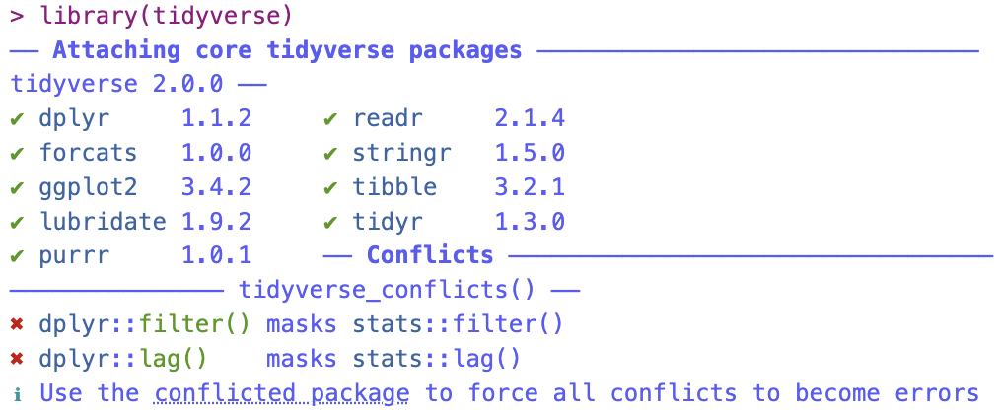

```{r include=FALSE}
library(tidyverse)
library(dcData)
knitr::opts_chunk$set(tidy=FALSE, message=FALSE)
options(width = 80)
```


## Agenda

- brief introduction to `::`
- `ggplot()` flyover
- remarks about facets
- `color` vs. `fill`


#### Reminders 

- Midterm is June 9$^{th}$ in class 
  - Review is posted on Canvas
  - Let me know if you have any questions or want solutions to previous assignments 
- Final Project Ideas + Groups due ----------
  - need a "solid" idea of what you might look at 
  - need data sets, or ideas for data sets 
    - these do not need to be your final data sets, but I just want to see you have been thinking about this project 
  - You can work by yourself or with a partner 
  - Fill out the canvas "quiz" to let me know if you want to work by yourself or with someone else. 
  - If you want to work with a partner, but don't know who to work with, let me know and I will find someone

## PackageName::FunctionName



- We can use the `::` function to reference functions inside packages. 
  - This helps us be extra sure that we are using the exact function we want to be
  - Helps avoid conflict (i.e. when 2 packages that have a function with the same name that do different things)
    - `select` is a very common function name. Usually we need to use `dplyr::select`


```{r, message=TRUE}
library(tidyverse)
head(diamonds)


#?filter

#filter from dplyr
diamonds %>%
  dplyr::filter(color == "E") %>%
  head()

#normal
diamonds %>%
  filter(color == "E") %>%
  head()

```


## Building Graphics

1. Draw by hand (or imagine) the specific plot that you intend to construct
2. Data Wrangling (if needed) to get the data in glyph-ready form, or verify that the current form is glyph-ready for your purposes.
3. Establish the frame using a `ggplot()` statement
4. Create the intended glyph using `geom_[style]()` such as
    - `geom_point()`
    - `geom_bar()`
    - `geom_boxplot()`
    - `geom_density()`
    - `geom_vline()`
    - `geom_segment()`
    - `geom_histogram()`
    - and *many* more
5. Map variables to the graphical attributes of the glyph using: `aes( )`
  - Rule of thumb: anytime when you are plotting with ggplot, ALL variables need to be inside an `aes` (except facets, later in slides), and all constants go outside of the `aes`.
    - e.g. `geom_point(aes(color = gender))` vs. `geom_point(color = "red")`
  
6. Add additional layers to the frame using the `+` symbol 
    - Note: **not** `%>%` between layers of `ggplot2` graphics
    - Think `+` is equivalent of "add layer on top of ..." in `ggplot2` portions, whereas `%>%` is  "and then the next step is..."

*Steps 4 and 5 can be switched.*


## Example: Baby Names 

Let's look at our `BabyNames` names data set agian. 

```{r}
# data intake
data("BabyNames", package = "dcData")

# inspect data intake
glimpse(BabyNames)

```


## wrangle into glyph-ready form


```{r}
names <- c("Olivia", "Zoe", "Quentin")

Names <- 
  BabyNames %>%
  filter(name %in% names) %>%
  group_by(name, year) %>%
  summarise(total = sum(count, na.rm = TRUE))

Names %>%
  head()

```


## in the beginning you might use mplot to get started--here's the default result

The graph looks perfectly fine, but this code isn't easy to read.

This is why we stress writing readable code! 

```{r}
ggplot(data = Names, aes(x = year, y = total)) + geom_line()  + aes(colour = name) + theme(legend.position = "right") + labs(title = "")
```


## we can do better 
1. establish the frame
2. plot the glyphs (i.e., select a geom)
3. map the aesthetics
4. add labels and title
5. other features (e.g., alpha, sizing, etc)


#### Our Plot 

1. Establish the Frame

Nothing is here! That is exactly what is supposed to happen. Calling `ggplot()` only tells us R that we are ready to plot and I want to create some space to make my plot. 

```{r}
ggplot(data = Names) 
  
```

2. plot the glyphs (i.e., select a geom)

Still Nothing! We need to tell it what our axis are. 

Note that ggplot uses `+`, NOT `%>%`. This is because we are **adding** layers to our plots.

```{r, error=T}
ggplot(data = Names) + 
  geom_line()

```


Note - this is why I like to map aesthetics first, so we can avoid errors. 


3. Map the aesthetics

Rule of thumb: anytime when you are plotting with ggplot, ALL variables need to be inside an `aes` (except facets, later in slides), and all constants go outside of the `aes`. 


```{r}
#not Quite
ggplot(data = Names) + 
  geom_line( aes(x = year, y = total)) 

#add groups
ggplot(data = Names) + 
  geom_line( aes(x = year, y = total, group = name)) 

#add color
# note that color includes the groups argument but not vice versa! 
ggplot(data = Names) + 
  geom_line( aes(x = year, y = total, color = name)) 


```


4. Add labels and title


```{r}
ggplot(data = Names) + 
  geom_line( aes(x = year, y = total, color = name)) +
  ggtitle("Names Over Time") +
  xlab("Year") +
  ylab("Popularity") +
  guides(color = guide_legend(title = "Siblings Names" ))


```


5. other features (e.g., alpha, sizing, etc)

```{r}
ggplot(data = Names) + 
  geom_line( aes(x = year, y = total, color = name, linetype = name)) +
  ggtitle("Names Over Time") +
  xlim(c(1972, 2022))+
  xlab("Year") +
  ylab("Popularity") +
  guides(color = guide_legend(title = "Siblings Names" ), 
         linetype = guide_legend(title = "Still Siblings Names" ))


```


## Remarks about faceting: `facet_wrap()`

The syntax for facets requires a formula syntax we haven't seen much yet.  There are two main ways to plot with facets.  Here are a few pointers:

### Facet Wrap

- `facet_wrap()` just makes a seperate plot for each level of the categorical variable
    - Syntax: `facet_wrap( ~ categoricalVariable)`
    - For example:

```{r}
data("NCHS")

# `!is.na(smoker)` finds cases that are non-missing for `smoker` (i.e. removes NA's)
Heights <- 
  NCHS %>%
  filter(age > 20, !is.na(smoker)) %>%   
  group_by(sex, smoker, age) %>%
  summarise(height = mean(height, na.rm = TRUE))

head(Heights)

Heights %>%
  ggplot(aes(x = age, y = height)) +   
  geom_line(aes(linetype = smoker)) +   
  facet_wrap( ~ sex)
```

## Facet Grid

- `facet_grid()` allows control of row & column facets
- `facet_grid()` syntax:
    - row & column facets: `facet_grid(rows ~ cols)`
    - row facets only: `facet_grid( rows ~ . )` (note the required "`.`") 
    - column facets only: `facet_grid( ~ cols)` (no "`.`" this time)

```{r}
Heights %>%
  ggplot(aes(x = age, y = height)) + 
  geom_line(aes(linetype = smoker)) + 
  facet_grid(sex ~ .)
```

```{r}
Heights %>%
  ggplot(aes(x = age, y = height)) + 
  geom_line() + 
  facet_grid(sex ~ smoker)
```


## Difference between `color` and `fill`

```{r}
library(mosaicData)

head(CPS85)

CPS85 %>% 
  ggplot() +
  geom_density(aes(x = wage, color = sex), alpha = 0.4)+
  facet_grid( ~ married) +
  xlim(0,30) 
  
CPS85 %>% 
  ggplot() +
  geom_density(aes(x = wage, fill = sex), alpha = 0.4)+
  facet_grid( ~ married) +
  xlim(0,30) 

  
CPS85 %>% 
  ggplot() +
  geom_density(aes(x = wage, fill = sex, color = sex), alpha = 0.4)+
  facet_grid( ~ married) +
  xlim(0,30)


CPS85%>%
  ggplot(aes(x = married, color = sex)) + 
  geom_bar() +
  facet_wrap( ~ union, scales = "free")  #Note the scales here 

CPS85%>%
  ggplot(aes(x = married, fill = sex)) + 
  geom_bar()+
  facet_wrap( ~ union, scales = "free")  #Note the scales here 


CPS85%>%
  ggplot(aes(x = age, y = wage, color = sex)) + 
  geom_point()

CPS85%>%
  ggplot(aes(x = age, y = wage, fill = sex)) +  #fill does not work for points!
  geom_point()


```


## Another Example using Diamonds Data

1. establish the frame
2. plot the glyphs (i.e., select a geom)
3. map the aesthetics
4. add labels and title
5. other features (e.g., alpha, sizing, etc)

1. Establish the Frame

```{r}
ggplot(data = diamonds)
```

2. plot the glyphs (i.e., select a geom)

```{r, error = TRUE}
ggplot(data = diamonds) +
  geom_point()

```

3. Map the aesthetics

```{r}
ggplot(data = diamonds, aes(x = carat, y = price)) +
  geom_point()

```


4. Add Titles and Labels 

```{r}
ggplot(data = diamonds, aes(x = carat, y = price)) +
  geom_point(aes(color = depth), alpha = 0.5, size = 1) +
  ggtitle("Diamonds Data") +
  xlab("Carat") +
  ylab("Price")

```


5. Add additional features 


Notice that I can have `aes` inside multiple statements. Notice that when I use constants (like `alpha = 0.3, size = 0.1`) they ARE NOT inside `aes`. 

In general, variables go inside `aes` and constants go outside of it. (unless we are using facets then see previous materials.)

```{r}
ggplot(data = diamonds, aes(x = carat, y = price)) +
  geom_point(aes(colour = depth), alpha = 0.3, size = 0.1) +
  ggtitle("Diamonds Data") +
  xlab("Carat") +
  ylab("Price") +
  facet_grid( cut ~ color)

ggplot(data = diamonds, aes(x = carat, y = price)) +
  geom_point(colour = "red", alpha = 0.3, size = 0.1) +
  ggtitle("Diamonds Data") +
  xlab("Carat") +
  ylab("Price") +
  facet_grid( cut ~ color)

```


## Side Note about placement of `aes`

`aes` can either go inside the `ggplot()` function, or inside the `geom_[chart]()` function itself, or both. The 3 following options create the same plots, but the code is slightly different. 

```{r, warning=F, message = F}
#option 1
ggplot(data = diamonds, ) +
  geom_point(aes(x = carat, y = price, color = clarity),
             alpha = 0.2, 
             size = 1) +
  geom_smooth(method = "glm" , 
              formula = y ~ poly(x, 2),                     # y = b_0 + b_1 x + b_2 x^2 + e
              aes(x = carat, y = price), 
              color = "red") +
  ylim(c(0, 20000))
  


#option 2
ggplot(data = diamonds, aes(x = carat, y = price, color = clarity)) +
  geom_point(alpha = 0.2, 
             size = 1) +
  geom_smooth(method = "glm" , 
              formula = y ~ poly(x, 2),                     # y = b_0 + b_1 x + b_2 x^2 + e
              aes(x = carat, y = price), 
              color = "red") +
  ylim(c(0, 20000))
  

#Option 3
ggplot(data = diamonds,  aes(x = carat, y = price) )+ 
  geom_point( aes(color = clarity),
              alpha = 0.2, 
              size = 1) +
  geom_smooth(method = "glm" , 
              formula = y ~ poly(x, 2),                     # y = b_0 + b_1 x + b_2 x^2 + e
              color = "red") +
  ylim(c(0, 20000))

```


- I personally prefer to put "global" aesthetics in the `ggplot()` and "local" aesthetics in the `geom`. 
  - Option 1 : all aesthetics are local to the geom
     - Note we have to repeat `x` and `y`
  - Option 2 : all aesthetics are global to the ggplot
    - Note that `color = clarity` is not needed for `geom_smooth`
  - Option 3 : global aesthetics are in the ggplot and local aesthetics and in the geom
    - Both `geom_point` and `geom_smooth` use `x` and `y` so I put them in the `ggplot()`
    - Only `geom_point` uses `color = clarity` so I put that ONLY in the `geom_point` function
    
- In my opinion, Option 3 is the "cleanest" code. This is partly based on stylistic preference and partly based on some internal mechanic of ggplot's (that is beyond the scope of this course). How you write your code is up to you. Just keep it readable!

- But again, all 3 codes generate the the exact same plot (so does it really matter that much which option we use??)

