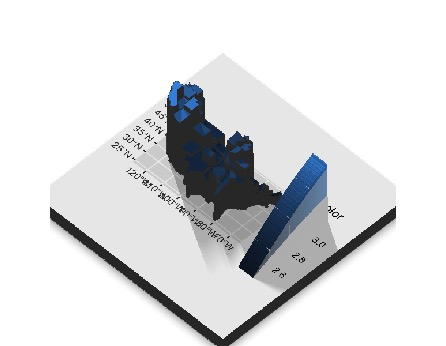

```{r message=FALSE, include=F}
# clean up R environment
rm(list = ls())

# load packages
library(tidyverse)
library(mosaic)
#devtools::install_github("cran/mdsr")
library(mdsr)

```


## Key Ideas

- Statistics is the area of science concerned with characterizing case-to-case variation and the collective properties of cases
- It's one thing to simply calculate quantities from data, but a central topic in statistics is the **precision** with which we can estimate those quantities
- **Accommodating and quantifying uncertainty due to randomness** is perhaps the backbone of inferential statistics 
- You **ALWAYS** need to report uncertainty and/or variation


## Key Ideas (continued)

- it's often useful to look at distributions of data graphically, and you were presented several useful ways to do so
    - density plots (perhaps overlaid or faceted to highlight group comparisons)
    - box plots (again, side-by-side or faceted to highlight group comparisons)
    - violin plots (alternative to box plots with greater detail in the density)
    - note, all of these plots show variation

- model functions help describe a relationship between an "input" (X, explanatory, independent) variable and an "output" (Y, response, dependent) variable 
    - smoothers show relationships between variables that bend with the data collectively
    - linear functions are also useful in some contexts, but sometimes miss important features of the relationship between variables

- confidence intervals (when estimating a single quantity) and confidence bands (when estimating model functions) are **essential** to communicate uncertainty
    - small sample sizes result in a great deal of uncertainty
    - we can be more confident in estimates produced by large sample sizes (asymptotic/ large sample theory)
    - error bars, notched box plots, and confidence bands all help communicate uncertainty in a graph.


## Recall: Key goals of a careful Exploratory Data Analysis

1. **Examine the data source:** variable types, coding, missingness, summary statistics/plots, who/what/when/where/why/how data were collected
2. **Discover features that influence may modeling decisions:** investigate potential outliers, consideration for recoding variables (e.g., numeric data that's functionally dichotomous), evaluate correlation structure (e.g., autocorrelation, hierarchy, spatial/temporal proximity)
3. **Address research questions:** build intuition and note preliminary observations/conclusions related to each research question.  Also, note observations that prompt you to refine your research questions or add new questions to investigate

...this is often an iterative process, but the order shown might help you organize your approach.


## Examples of Graphs 

##### Means 

```{r, message=F}
#Set up data 
#?AirPassengers
class(AirPassengers)
dat_passengers <- data.frame(1949:1960,
                             matrix(AirPassengers, ncol = 12))
colnames(dat_passengers) <- c("Year", month.abb)

head(dat_passengers)

# Wrangle 
GlyphReadyData <- dat_passengers %>%
  pivot_longer(!Year, names_to = "Month", values_to = "Val") %>%
  group_by(Year) %>%
  summarise(Mean = mean(Val, na.rm = T), 
            SD = stats::sd(Val, na.rm = T))
head(GlyphReadyData)


```


Here are multiple ways of displaying the same data

```{r}
ggplot(GlyphReadyData, aes(x = Year, y = Mean)) +
  geom_point()+
  xlab("Year") +
  ylab("Passengers")


ggplot(GlyphReadyData, aes(x = Year, y = Mean)) +
  geom_point() +
  geom_line()+
  xlab("Year") +
  ylab("Passengers")

dat_passengers %>%
  pivot_longer(!Year, names_to = "Month", values_to = "Val") %>%
  ggplot( aes(x = as.factor(Year), y = Val)) +
  geom_boxplot() +
  geom_point(aes(y = mean(Val)), col = 2) + 
  xlab("Year") +
  ylab("Passengers")

#color 2 is red, 3 is green, 4 is blue, 5 is cyan, 6 is purple, 7 is yellow, and so on..... 
# R also understands HEX codes as colors 

ggplot(GlyphReadyData, aes(x = Year, y = Mean)) +
  geom_point()+
  geom_errorbar(aes(ymin = Mean - 2 * SD, ymax = Mean + 2 * SD))+
  xlab("Year") +
  ylab("Passengers")

dat_passengers %>%
  pivot_longer(!Year, names_to = "Month", values_to = "Val") %>%
  ggplot()+
  geom_point(aes(x = as.factor(Year), y = Val), alpha = 0.5) +
  geom_point(data = GlyphReadyData, aes(x = as.factor(Year), y = Mean), col = 2, shape = 4, size = 4) +
  xlab("Year")
  
```

##### Questions

- Which graph would you choose to display? why?
- How does your perception of the data change between each graph?
- What other graphs might you want to make? 
- Would this information better be displayed as a table? Why or why not? 


## Guided Example: SAT Data exploration


**Statement of Research Question**

Are higher teacher salaries associated with better state-wide SAT scores?


#### Examine the data source

for example: 

- who/what/when/where/why/how data were collected
- review data intake
- variable types, 
- coding, 
- missingness, 
- basic summary statistics and plots to learn about variables


```{r}
data("SAT_2010")

# review data intake & variable coding
glimpse(SAT_2010)
head(SAT_2010)
tail(SAT_2010)

```

```{r}
# missingness & summary statistics 
favstats( ~ salary, data = SAT_2010)
favstats( ~ total, data = SAT_2010)


SAT_2010 %>%
    ggplot(aes(x = salary)) +
    geom_density() +
    geom_rug() +
    xlab("State average teacher salary (US dollars)")


SAT_2010 %>%
    ggplot(aes(x = total)) +
    geom_density() +
    geom_rug() +
    xlab("State average total SAT score")


```


## Discover features in the data that may impact modeling decisions

Some of this is based on scrutiny of the data collection practices (and study design), but much of it can be substantiated in EDA

- investigate outliers
- functionally dichotomous variables--e.g., survey asks people to rate job approval of president on scale of 1-7, but most people choose either 1 or 7 and the options in between are rarely used
- highly correlated predictor variables
- hierarchy or nesting--e.g., data from students within classrooms within schools
- repeated observations of the same "case"--e.g., medical study follows up with the same group of patients every 6 months


```{r}

SAT_2010 %>%
    ggplot(aes(x = salary, y = sat_pct)) +
    geom_point() +
    # geom_smooth() +     # if linear is reasonable, consider method = "lm"
    xlab("State average teacher salary (US dollars)") +
    ylab("Percentage of students who take the SAT")


SAT_2010 %>%
    ggplot(aes(x = expenditure, y = sat_pct)) +
    geom_point() +
    # geom_smooth() +
    xlab("State average expenditure per student") +
    ylab("Percentage of students who take the SAT")


SAT_2010 %>%
    filter(sat_pct < 25, expenditure > 15)


# density of sat_rate... apparent gap (why??)
SAT_2010 %>%
    ggplot(aes(x = sat_pct)) +
    geom_density() +
    geom_rug() +
    xlab("Percentage of students who take SAT in each state")


SAT_2010 <-
    SAT_2010 %>%
    mutate(sat_rate = cut(sat_pct, breaks = c(0, 30, 70, 100),
                          labels = c("low", "med", "high")))
    # mutate(sat_rate = cut(sat_pct, breaks = c(0, 40, 100),
    #                       labels = c("lower", "higher")))


```


## Address research question

- one or a few key data visualizations that are most informative to a reader/observer
- include data visualization (but not exclusively) 
- often requires exploring many data visualizations to find the one or few that most effectively communicate intuition for your research question
- we may even do some exploratory modeling here


```{r}

SAT_2010 %>%
    ggplot(aes(x = salary, y = total)) +
    geom_point() +
    # geom_smooth() +
    # geom_smooth(method = "lm") +
    xlab("State average teacher salary (US dollars)") +
    ylab("State average total SAT score")


SAT_2010 %>%
    ggplot(aes(x = expenditure, y = total, color = sat_pct)) +
    geom_point() +
    # geom_smooth() +
    # geom_smooth(method = "lm") +
    xlab("State average teacher salary (US dollars)") +
    ylab("State average total SAT score")

SAT_2010 %>%
    ggplot(aes(x = expenditure, y = total, color = sat_rate)) +
    geom_point() +
    # geom_smooth() +
    # geom_smooth(method = "lm") +
    xlab("State average teacher salary (US dollars)") +
    ylab("State average total SAT score")

# since we have state data, maybe we should map it!
library(mosaic)
mUSMap(SAT_2010, key = "state", "fill" = "sat_rate")
mUSMap(SAT_2010, key = "state", "fill" = "total")

```


## A cool side note (if we have time)

- `mUSMap` is part of the `mosaic` package, not the `tidyverse`.
- There is a way to plot maps with `ggplot` but it is slightly more complicated syntax than `mUSMap`. 
- There are 2 types of ggplot maps

  - polygon maps 
    - you can create very simple maps 
    - this is essentially treating each boarder as a shape, then mapping the shape to each geographic coordinate (latitude and longitude)
    - simple “longitude-latitude” data format is not usually used in real world mapping
    
  - simple features maps 
    - can make beautiful maps with lots and lots of features 
      - can handle map projections, labels, colors, adding additional points (like cities), and so on
    - much more versatile (at the price of complexity)
    - uses vector data maps (GIS) <https://en.wikipedia.org/wiki/Vector_Map>
      - standard by the Open Geospatial Consortium
    - uses the `sf` package 
    - essentially, data contains 2 columns, first column is location name, second column contains the "sf" polygon information (any additional columns are characteristics of the location)
      - these data sets are extremely tedious (and complex) to write. It is usually better to find someone else data set and adapt it to your needs. The `rnaturalearth` package is a good place to start has countries and US states. The `sf` package has some starter data sets for playing around with.
      
  - "raster" maps 
    - uses geo-spatial data 
    - "Unlike the simple features format, in which geographical entities are specified in terms of a set of lines, points and polygons, rasters take the form of images."
    - think satellite images 
      
- Here is a tutorial <https://ggplot2-book.org/maps.html> on polygon, sf, and raster maps. 

Here are the basic steps for a simple features map of our state data colored by pupil-teacher-ratio: 


```{r, message = F}
library(sf)
library(ggspatial)
library(rnaturalearth)
library(tidygeocoder)
library(maps)
library(ggrepel)

#Get state map data 
state_map_data <- map('state', fill = TRUE, plot = FALSE) %>% st_as_sf()

#inspect state map data 
class(state_map_data)
head(state_map_data)

# Merge it with our SAT data 
SAT2 <- SAT_2010 %>%
  mutate(state = tolower(state)) %>%
  filter(!(state) %in% c("alaska", "hawaii")) 

state_map_data <- state_map_data %>%
  filter(ID != "district of columbia")

#color on the log scale 
state_map_data$color <- log(SAT2$pupil_teacher_ratio)

#make the ggplot
gg_sat <-  ggplot() +
  geom_sf(data = state_map_data, aes(fill = color)) +
  guides(fill=guide_legend(title="log(Pupil-Teacher Ratio)"))

gg_sat

```

This is great! But it is essentially the exact same map as using `usMap` but with a ton more work. 

A few notes:

- I personally prefer to plot color on the log scale (usually but not always). This is not necessary, but I find it easier to see broad trends as it dampens the extremity of the maximum. Not everyone prefers this method.

- Notice the order on the legend goes smallest at the top to largest at the bottom. This is counterintuitive. If I were to add this graphic to a report, I would make sure it legend went largest to smallest.

- Notice this map and the `mUSMap` have different map projections. `mUSMap` defaults to a polyconic projection, and `geom_sf` defaults to whatever projection your data frame is in (here it using a Mercator projection). Both methods allow you to change the map projection.


## Side, Side note about plotting in 3D

With this ggplot and sf method of plotting maps, it is possible to plot your maps in 3D using the `rayshader` package. 

```{r, eval = F}
#devtools::install_github("tylermorganwall/rayshader")
library(rayshader) 
plot_gg(gg_sat, multicore = TRUE, 
        scale = 300,  zoom = 0.75, 
        phi = 50, sunangle = -60, theta = 45)
render_snapshot()

```




While this may look super cool, did plotting in the 3D add to our interpretation of the graph? Did we just add unnecessary graphics? 

In data visualization it is always important to balance glyphs with interpretability. We need to add enough so that the viewer understands the story we are trying to tell, but not so much that the graph is "messy" or "cluttered". 


####  Examples when adding 3D does add value 

- Election Results
  - <https://www.arcgis.com/apps/MinimalGallery/index.html?appid=b3d1fe0e8814480993ff5ad8d0c62c32>
- Population Density
  - <https://www.visualcapitalist.com/3d-mapping-the-worlds-largest-population-densities/>
- Cartography (particularly elevation)
  - `elmat` example <https://www.rayshader.com>
- Contours and Joint Densities 
  - <https://plotly.com/r/3d-surface-plots/>
  - <https://rviews.rstudio.com/2020/12/14/plotting-surfaces-with-r/>
  - <http://www.countbio.com/web_pages/left_object/R_for_biology/R_fundamentals/3D_surface_plot_R.html>
  - diamonds example <https://www.rayshader.com>


## Statistical modeling

After we have completed a thorough EDA, we are ready for inferential or predictive modeling.  

Again, statistical modeling can definitely serve exploratory and descriptive purposes that are appropriate during EDA (e.g., we fit smoothers & regression lines above), but they do impose a kind of structure on the data that influences (biases) our expectations.  It's a good idea to learn as much as we can about the data while imposing as little structure as possible, and then gradually adding more structure to progressively refine our understanding.  

Ideally, we want to let the data speak for itself, and then use appropriate analytical results like models to simply refine interpretations/predictions and more precisely quantify the uncertainty of our conclusions.  


